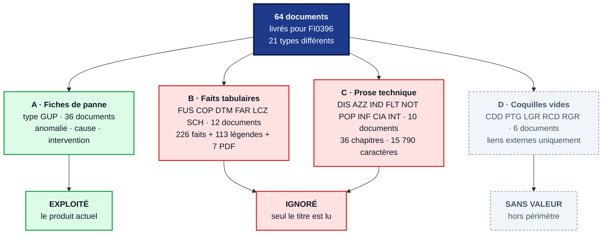
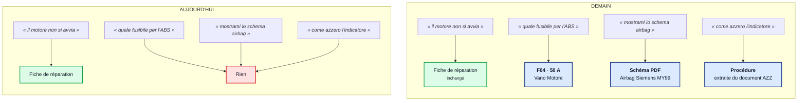
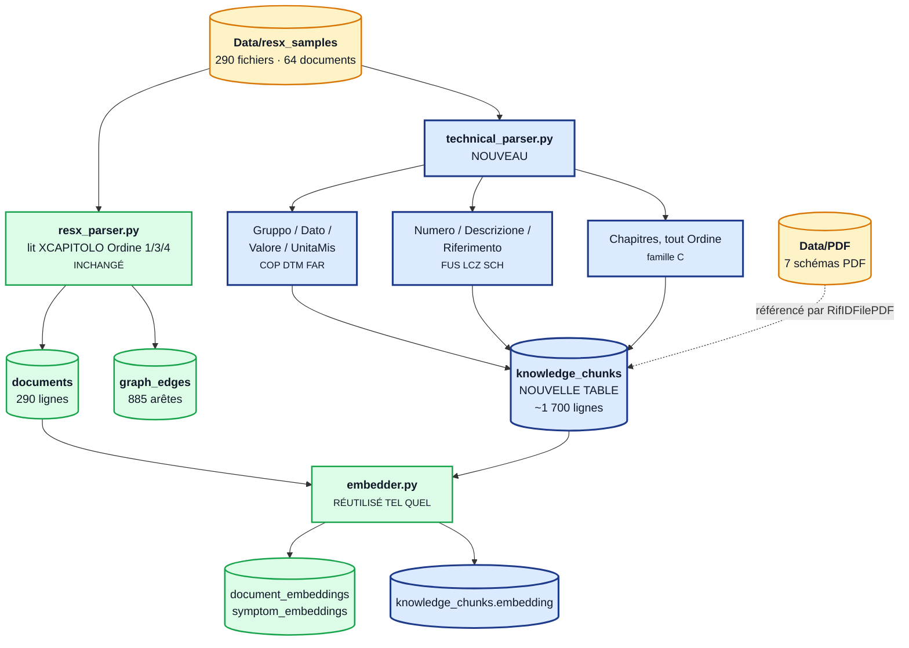
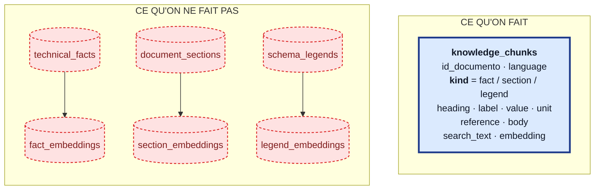
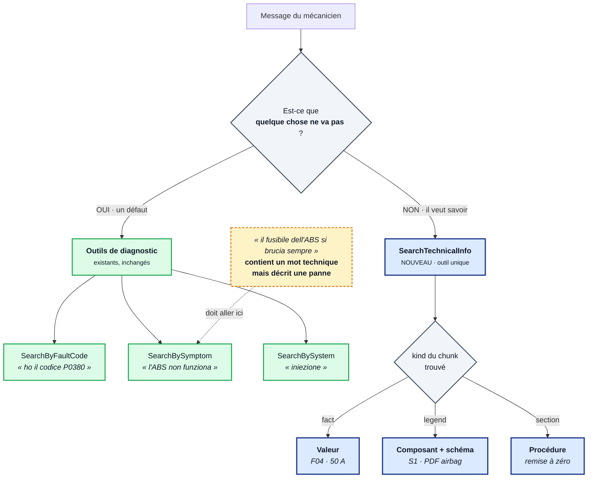
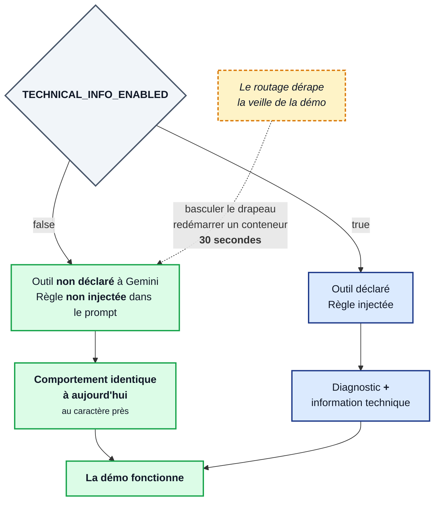
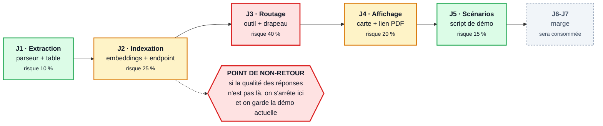
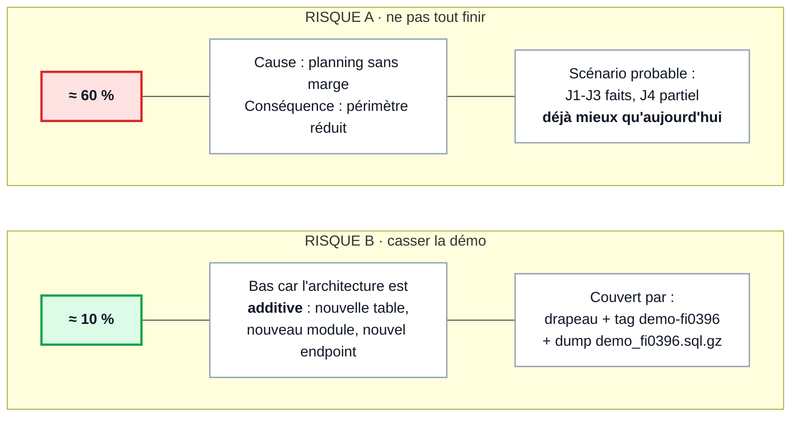
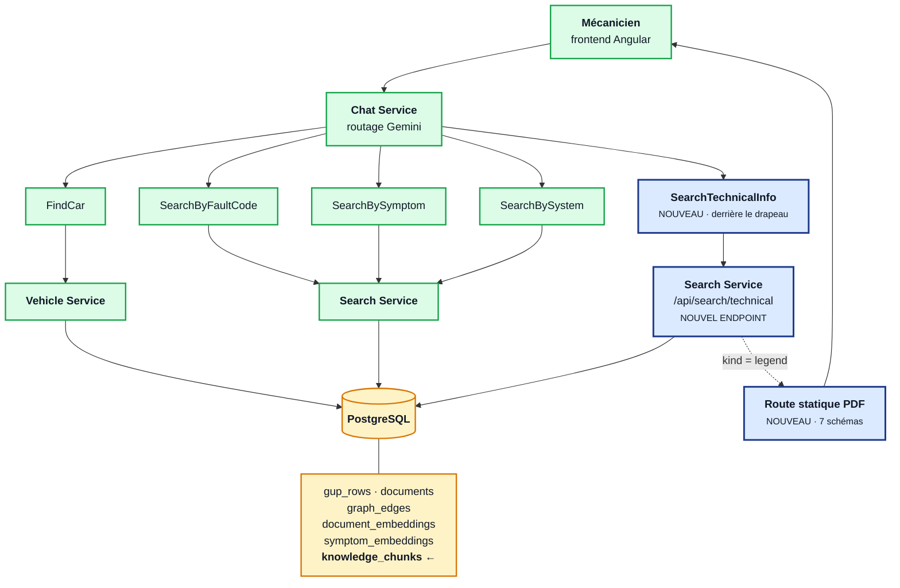

# Extension v2 — les schémas

> Accompagne [Architecture_Extension_v2.md](Architecture_Extension_v2.md).
> Aperçu Mermaid : `Ctrl+Shift+V` dans VS Code.

---

## 1. Ce que contiennent les 64 documents

Quatre familles. Une seule est exploitée aujourd'hui.

**À retenir :** 22 documents sur 64 contiennent de la vraie matière inexploitée. La
famille C est la surprise — elle n'était pas dans la proposition initiale, et c'est la
moins chère à récupérer.

---

## 2. Aujourd'hui vs demain

Ce qui change du point de vue du mécanicien.

Le produit passe de *« je te trouve un document »* à *« je te donne la réponse »*.

---

## 3. Le pipeline d'ingestion

En vert ce qui existe et **n'est pas touché**. En bleu ce qu'on ajoute.

**Le point clé :** `resx_parser.py` n'est pas modifié. Il fait tourner la démo, on n'y
touche pas. Le nouveau parseur vit à côté.

---

## 4. Une seule table, pas trois

Le choix d'architecture le plus important.

Six tables, trois parseurs, trois chemins de recherche — contre une table, un passage
d'embeddings, une requête. **Et surtout : `DROP TABLE knowledge_chunks` annule tout.**

C'est moins élégant sur le papier. C'est le bon choix pour un planning sans marge.

---

## 5. Le routage — la décision du modèle

Un seul outil nouveau, donc **une seule frontière** à faire comprendre au modèle.

**Le piège en jaune est le cas à tester en priorité.** Il contient le mot « fusibile »
mais décrit un défaut : c'est exactement là qu'un modèle mal instruit se trompera et
dégradera une recherche qui marche aujourd'hui.

La nature de la réponse est décidée **en aval**, par le `kind` du chunk — pas par le
modèle. C'est ce qui permet de n'avoir qu'un seul outil.

---

## 6. Le drapeau de fonctionnalité — ton filet de sécurité

**À poser au jour 1, pas à la fin.** Ajouté à la fin, il ne protège de rien.

---

## 7. La feuille de route

Chaque jour se termine sur un état démontrable. Si le temps manque, on s'arrête au
dernier jour terminé — rien n'est laissé à moitié fait.

---

## 8. Les deux risques — à ne pas confondre

**C'est le risque B qui devrait guider ta décision, pas le A.** Ne pas tout finir coûte un
périmètre réduit. Casser la démo coûte la démo.

---

## 9. Vue d'ensemble — où tout se branche

Tout ce qui est en vert existe et continue de fonctionner à l'identique. Tout ce qui est
en bleu s'ajoute à côté, sans rien remplacer.
