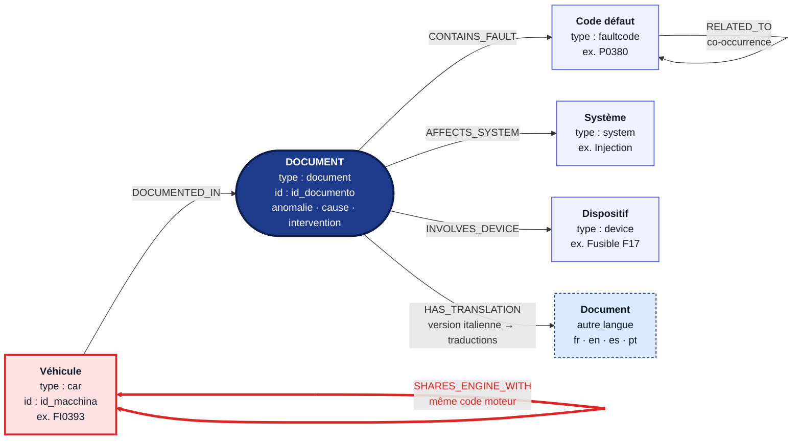
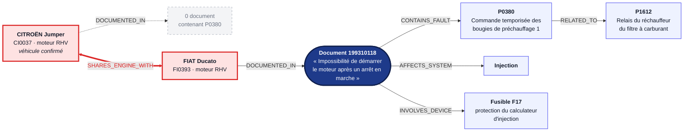
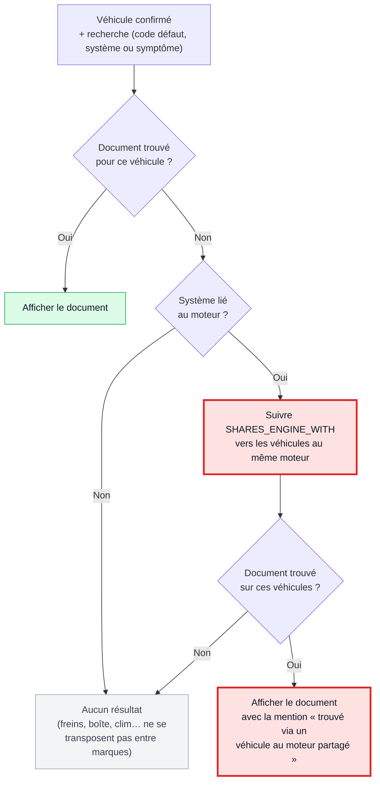

# Graphe de connaissances — SemaRepair

Ce document décrit le graphe de connaissances **tel qu'il est réellement
construit dans le code**. Les sources vérifiées sont :

- `services/ingestion-resx/graph_builder.py` : construction des arêtes
- `services/ingestion-resx/schema.sql` : table `graph_edges`
- `services/search/Controllers/SearchController.cs` : utilisation de
  `SHARES_ENGINE_WITH` pour le fallback
- la base PostgreSQL en fonctionnement, pour les volumes

Le graphe est stocké dans une seule table PostgreSQL, `graph_edges`. Chaque
ligne est une arête `(from_type, from_id) —relation→ (to_type, to_id)`,
éventuellement associée à une langue (`language`). Les arêtes
`CONTAINS_FAULT` portent aussi une description (`description`).

---

## Figure 1 — Schéma du graphe (types de nœuds et relations)

Le **Document** est le nœud central : toutes les connaissances de réparation
(codes défaut, système, dispositif, traductions) s'y rattachent, et le
véhicule y accède par `DOCUMENTED_IN`. La relation **`SHARES_ENGINE_WITH`**,
en rouge, relie deux véhicules qui ont le même code moteur. C'est elle qui
permet le fallback intelligent.

---

## Figure 2 — Exemple réel : le fallback par moteur partagé

Données réelles de la base locale. Le mécanicien a confirmé un **CITROËN
Jumper** (moteur `RHV`) et cherche le code défaut **P0380**. Aucun document de
ce véhicule ne contient ce code. Le graphe suit alors `SHARES_ENGINE_WITH`
vers le **FIAT Ducato**, qui a le même moteur `RHV`, et trouve un document
pertinent. Le document est affiché en indiquant clairement qu'il provient
d'un véhicule d'une autre marque partageant le même moteur
(`foundViaSharedEngine = true`).

---

## Les 7 relations construites

Les volumes proviennent de la base locale : 157 véhicules, 108 documents en
5 langues (540 versions), et 3 663 arêtes au total.

| Relation | De → Vers | Construction (`graph_builder.py`) | Langue | Arêtes |
|---|---|---|---|---|
| `DOCUMENTED_IN` | Véhicule → Document | une arête par ligne de `gup_rows` (fichier `GUP_PER_IA.xlsx`) | — | 666 |
| `SHARES_ENGINE_WITH` | Véhicule ↔ Véhicule | toute paire de véhicules ayant le même `codice_motore_macchina`, **dans les deux sens** | — | 282 |
| `CONTAINS_FAULT` | Document → Code défaut | codes DTC extraits du resx, avec leur description | oui | 588 |
| `AFFECTS_SYSTEM` | Document → Système | champ `impianto` du resx | oui | 532 |
| `INVOLVES_DEVICE` | Document → Dispositif | champ `dispositivo` du resx | oui | 517 |
| `HAS_TRANSLATION` | Document → Document | version italienne (`<id>_it`) → chaque autre langue (`<id>_fr`, …) | — | 432 |
| `RELATED_TO` | Code défaut → Code défaut | codes apparaissant dans le même document (combinaisons par paire) | oui | 426 |

---

## Comment `SHARES_ENGINE_WITH` sert au fallback

Cette relation n'est utilisée qu'**après la confirmation du véhicule**, quand
la recherche directe ne donne rien. Le déroulement est le suivant :

Le fallback est limité aux **systèmes liés au moteur**, définis par une liste
blanche dans `SystemCategoryLookup.cs`. Elle contient les noms italiens stockés
dans les données : *Iniezione*, *Alimentazione carburante*, *Candelette*,
*Sensori motore*, *Gestione motore*, *Alimentazione motore*, *Sistema di
accensione* et *Sistema di scarico*. Un même moteur ne signifie pas que les freins ou
la climatisation sont identiques : on ne transpose donc que ce qui dépend
réellement du moteur.

---

## Écart avec la documentation d'architecture (§5.5)

La section 5.5 de `SemaRepair_Architecture.md` décrit un modèle conceptuel de
**11 relations**. Seules les **7 relations ci-dessus** sont implémentées. Les
4 suivantes ne sont pas construites :

| Relation prévue | Pourquoi elle n'est pas nécessaire aujourd'hui |
|---|---|
| `Brand —HAS_MODEL→ Model` | marque et modèle sont des colonnes de `gup_rows`, interrogées en SQL par le Vehicle Service |
| `Model —HAS_ENGINE→ Car` | idem : pas de nœuds Marque/Modèle séparés |
| `Document —HAS_SYMPTOM→ Symptom` | le symptôme (`anomalia`) est géré par recherche vectorielle (table `symptom_embeddings`), pas par une arête |
| `System —CONTAINS→ Device` | aucun parcours de recherche actuel ne l'utilise |
