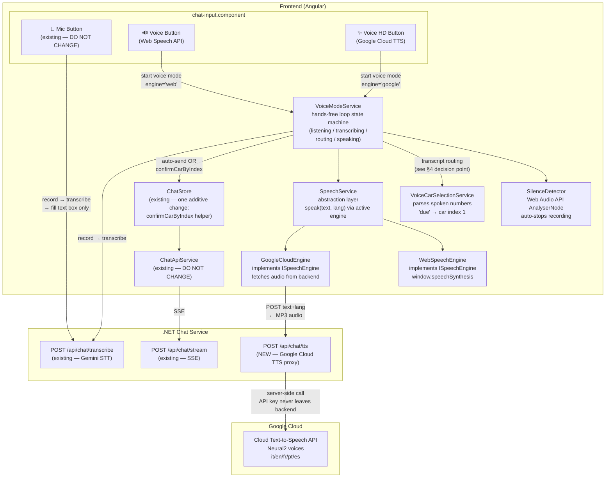
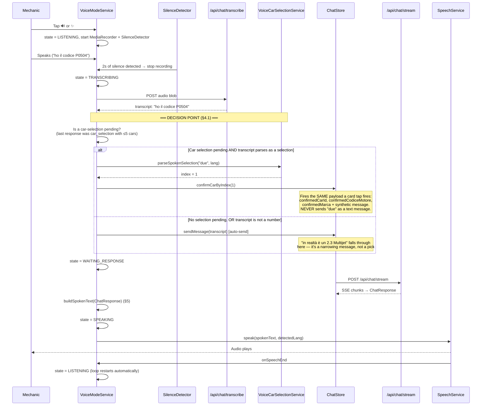

# SemaRepair v2 — Voice Mode Architecture & Implementation Spec (v2)

> **Purpose:** This document is the authoritative specification for
> implementing voice mode in SemaRepair v2. Claude Code must read this
> file in full before writing any code. All decisions are final unless
> explicitly listed in Section 12 (Open Items).
>
> **v2 changes from v1:** fixed the car-selection interception gap in
> the pipeline (transcripts are NOT unconditionally auto-sent), moved
> silence detection into Phase 1 (required for hands-free, not polish),
> added the iOS Safari TTS limitation and its handling, fixed the
> `cases[]` vs `documents[]` field naming inconsistency, added a
> mandatory pre-implementation verification for `foundViaSharedEngine`
> propagation, and added complete error handling for every failure
> point in the pipeline.

---

## 1. Overview

SemaRepair v2 adds two new interaction buttons to the chat input bar,
alongside the existing Mic button:

| Button | Icon | Name | Behavior |
|--------|------|------|----------|
| Existing | 🎤 | **Mic** | Dictate → fill text box → manual send → read screen |
| New | 🔊 | **Voice** (Web Speech API) | Auto-send → browser TTS speaks response → hands-free loop |
| New | ✨ | **Voice HD** (Google Cloud TTS) | Auto-send → premium neural voice speaks response → hands-free loop |

The Mic button already exists and must not change in any way. The two
new Voice buttons share the same pipeline — only the TTS engine differs,
behind a common `ISpeechEngine` interface.

**Why three buttons:** the boss/client will demo all three side by side
and decide which TTS engine goes to production. The shared abstraction
layer makes the second engine cheap to add.

**Platform support matrix (important — read before building):**

| Platform | 🎤 Mic | 🔊 Voice (Web Speech) | ✨ Voice HD (Google TTS) |
|----------|--------|----------------------|--------------------------|
| Desktop Chrome/Edge | ✅ | ✅ | ✅ |
| Desktop Firefox | ✅ | ⚠️ voice quality varies | ✅ |
| iOS Safari / iPad | ✅ | ❌ **blocked** (see §10.3) | ✅ (with audio unlock, see §10.3) |
| Chrome Android | ✅ | ⚠️ known cutoff bug (see §10.3) | ✅ |

---

## 2. Architecture Diagram



---

## 3. The Three-Button UI Layout

Current input bar: `[🎤 mic] [text input] [send]`

After this feature: `[🎤 mic] [🔊 voice] [✨ voice HD] [text input] [send]`

**Visual states:**

```
Idle (voice mode OFF):
[🎤]  [🔊]  [✨]  [  Descrivi il problema...  ]  [➤]

Listening (Web Speech voice mode active, recording):
[🎤]  [🔊●] [✨]  [  Sto ascoltando...        ]  [➤]
       ↑ pulsing red dot

Transcribing/processing:
[🎤]  [🔊◌] [✨]  [  Elaborazione...          ]  [➤]
       ↑ spinner

Speaking (response being read aloud):
[🎤]  [🔊▶] [✨]  [  Sto parlando... (tocca per interrompere) ]  [■]
       ↑ animated speaker; tapping the button OR the ■ stops TTS

Voice HD states: identical, but the indicator is on the ✨ button.
```

**Interaction rules:**
1. Only one voice mode active at a time.
2. Tapping the **active** voice button = stop voice mode entirely
   (stop recording if listening, stop TTS if speaking, return to idle).
3. Tapping the **other** voice button while one is active = stop current
   mode, start the other engine fresh (not mid-turn — cancels any
   in-flight recording/TTS first).
4. The 🎤 Mic button is disabled (greyed out) while a voice mode is
   active, and re-enabled when voice mode stops. This prevents two
   simultaneous recordings. It is the ONLY change to the Mic button —
   a `[disabled]` binding — its own logic must not be touched.
5. Typing in the text input while voice mode is active immediately
   stops voice mode (the mechanic has chosen to type instead).

---

## 4. The Voice Pipeline — State Machine and the Critical Decision Point

The hands-free loop is a state machine managed by `VoiceModeService`:

```
IDLE → LISTENING → TRANSCRIBING → [DECISION POINT] → WAITING_RESPONSE → SPEAKING → LISTENING (loop)
```



### 4.1 The Decision Point — Transcript Routing (MANDATORY)

**Transcripts are NEVER unconditionally auto-sent.** After every
transcription, `VoiceModeService` routes the transcript:

```typescript
private routeTranscript(transcript: string): void {
  const pendingSelection = this.chatStore.lastResponse()?.resultType === 'car_selection'
    && (this.chatStore.lastResponse()?.cars?.length ?? 0) <= 5;

  if (pendingSelection) {
    const index = this.voiceCarSelection.parseSpokenSelection(
      transcript, this.chatStore.detectedLanguage());
    if (index !== null && index < this.chatStore.lastResponse()!.cars.length) {
      // Spoken car pick → same structured payload as a card tap.
      // Reuses the EXACT confirmCar mechanism from the IVECO fix:
      // confirmedCarId + confirmedCodiceMotore + confirmedMarca.
      this.chatStore.confirmCarByIndex(index);
      return; // transcript is consumed — NOT sent as a message
    }
    // Not a recognizable number → fall through: it's a narrowing
    // message like "è un 2.3 Multijet del 2015", send it normally.
  }

  this.chatStore.sendMessage(transcript); // normal auto-send path
}
```

**Why this matters:** confirming a car is a structured payload
(`confirmedCarId` etc.), not a text message. Sending "due" as a plain
message would reach Gemini routing with no context that it means
"car #2", and a 1-word message risks the TooVague validation path.
The IVECO multi-trim disambiguation fix depends on `confirmedCarId`
being sent — a spoken selection must produce the identical payload.

**`confirmCarByIndex(i)`** is a new small helper on `ChatStore`: it
looks up `lastResponse().cars[i]` and calls the existing `confirmCar()`
with that car's `idMacchina`, `codiceMotore`, `marca` — exactly what
the card's click handler does today. It must not duplicate the
payload-building logic; extract/reuse the card click path.

### 4.2 Silence Detection (Phase 1 — REQUIRED, not polish)

Without automatic stop, every turn needs a screen tap to end the
recording — which breaks the entire hands-free premise and makes
Phase 1's verification gate impossible. Silence detection is therefore
a Phase 1 requirement.

**Implementation:** Web Audio API `AnalyserNode` on the same
`MediaStream` the `MediaRecorder` uses:

```typescript
class SilenceDetector {
  // Monitors RMS amplitude on the mic stream.
  // Rules:
  // - Recording does not stop during the first 1.5s (grace period —
  //   gives the mechanic time to start speaking)
  // - After speech has been detected at least once, 2.0s of continuous
  //   silence (RMS below threshold) stops the recording
  // - Hard cap: 30s max recording regardless of silence (safety)
  // - If NO speech is ever detected within 8s of activation, stop and
  //   return to LISTENING with a brief spoken hint:
  //   "Non ho sentito nulla. Parla pure." (localized)
  //   After 2 consecutive empty attempts, exit voice mode entirely
  //   (prevents an infinite silent loop draining battery/mic)
  start(stream: MediaStream, onSilence: () => void): void
  stop(): void
}
```

The threshold value should be a named constant with a comment, tuned
during Phase 1 verification against a real microphone — do not
hardcode a magic number without testing it.

---

## 5. What Gets Spoken — Complete Rules

> **CRITICAL RULE (non-negotiable):** everything spoken comes verbatim
> from fields already present in Chat Service's `ChatResponse`. No
> Gemini call at TTS time, no paraphrasing, no generated content.
> Repair instructions (`causa`, `intervento`) are read exactly as
> stored in the database. Only the localized wrapper strings in §7
> are added by frontend code.

> **FIELD NAMING:** the frontend receives Chat Service's `ChatResponse`
> whose document array is `cases[]` (type `CaseSummary`). Search
> Service's `documents[]` never reaches the frontend. All pseudocode
> below uses `cases[]` exclusively.

### 5.0 MANDATORY pre-implementation verification

Before writing `buildSpokenText()`, verify in the actual code:

1. **Does `CaseSummary` (Chat Service model + frontend model) carry
   `foundViaSharedEngine`?** Search Service's `DocumentResult` has it,
   but it may not be propagated into Chat's `cases[]`. Check
   `RepairOrchestrator`'s case-splicing code (where DocumentResults
   are copied into ChatResponse.Cases after Gemini's formatting call).
   - If YES → §5.6 works as written.
   - If NO → STOP and report back before implementing. The fix (adding
     one bool field to CaseSummary + the splice) touches
     RepairOrchestrator, which is on the do-not-touch list (§11.1) —
     it needs explicit approval as a scoped exception, not a silent
     change.
2. **Confirm the exact frontend field names** in `chat.models.ts`
   (`causa`, `intervento`, `cars`, `cases`, `resultType`, `message`) —
   the pseudocode below assumes these names; adjust to the real model,
   do not adjust the real model to the pseudocode.

### 5.1 Single document found (resultType='document', cases.length === 1)

**Spoken:** `causa` + `intervento`.
**Visual only:** `titolo`, `impianto`, `dispositivo`, `anomalia`,
`nota`, `dtcCodes`, `reliability`.

Why: `nota` is typically a long component-location description — far
more useful on screen (re-readable) than spoken once. DTC codes are
unusable read aloud.

```
Example (GUP97380):
Speaks: "Causa: interruttore stop difettoso. Intervento: verificare
il corretto funzionamento dell'interruttore stop e se necessario
procedere alla sua sostituzione."
Duration ≈ 8s ✓
```

### 5.2 Multiple documents (resultType='document', cases.length 2–4)

**Spoken:** count announcement + FIRST case's `causa` + `intervento`
+ see-screen suffix. **Visual:** all cards.

Why first only: results arrive relevance-ordered; reading 3–4 full
cases takes 30s+ and is unmemorable.

```
Speaks: "Ho trovato 3 casi. Il più rilevante — causa: corpo
farfallato motorizzato difettoso. Intervento: verificare il corretto
funzionamento del corpo farfallato e se necessario sostituirlo.
Guarda lo schermo per gli altri casi."
Duration ≈ 12s ✓
```

### 5.3 Too many documents (resultType='vague', count ≥ 5)

**Spoken:** `message` field verbatim (already contains the Rule 10
"14 found, showing 3, add detail" text). **Visual:** the 3 cards.

### 5.4 Car selection (resultType='car_selection')

**≤ 5 cars — spoken numbered list:**
```
"Ho trovato 3 veicoli. Uno: 2.8 JTD 8v, 2002–2006.
 Due: 2.8 JTD 4X4 8v, 2002–2006.
 Tre: 2.8 JTD Power 8v, 2004–2006. Quale?"
```
- `annoFine === 9999` is spoken as the localized "today" word
  ("oggi"/"today"/"aujourd'hui"/"hoje"/"hoy") — same convention as the
  header badge.
- After speaking, the loop returns to LISTENING and the next
  transcript goes through the §4.1 decision point.

**> 5 cars — do NOT read the list:**
```
"Ho trovato molti veicoli. Puoi dirmi l'anno e la cilindrata?"
```
Visual grid still shows everything; the spoken prompt asks the
mechanic to narrow. Their next utterance is a narrowing message
(falls through the decision point to normal auto-send).

### 5.5 Not found (resultType='not_found')

**Spoken:** `message` verbatim (already carries the specific
year-range suggestion text when applicable, e.g. "Non abbiamo un
Ducato del 2020, ma lo abbiamo dal 2021 a oggi").

### 5.6 Rule 8 cross-brand fallback

**Detection:** `cases[0].foundViaSharedEngine === true` (subject to
the §5.0 verification).
**Spoken:** `message` verbatim (contains the mandatory disclosure
wording) — then STOP. Do not read causa/intervento yet: Rule 8's
contract is ask-first. The mechanic's spoken "sì"/"yes" is the next
turn; the affirmative reply flows through the normal pipeline (Gemini
already handles the permission turn), and the SUBSEQUENT response —
the actual document — is spoken per §5.1.

### 5.7 Clarification / TooVague (validationMessage present)

**Spoken:** `message` verbatim.

### 5.8 buildSpokenText() — the complete decision function

```typescript
function buildSpokenText(r: ChatResponse, lang: Lang): string {
  // Guard: nothing to say
  if (!r) return '';

  // Rule 8 cross-brand: message only, ask-first (see §5.6)
  if (r.cases?.[0]?.foundViaSharedEngine) {
    return r.message ?? '';
  }

  switch (r.resultType) {
    case 'document': {
      const c = r.cases?.[0];
      if (!c) return r.message ?? '';
      if (r.cases.length === 1) {
        return `${t(lang,'causa_label')}: ${c.causa}. ` +
               `${t(lang,'intervento_label')}: ${c.intervento}.`;
      }
      return `${t(lang,'found_n_cases', r.cases.length)} ` +
             `${t(lang,'causa_label')}: ${c.causa}. ` +
             `${t(lang,'intervento_label')}: ${c.intervento}. ` +
             `${t(lang,'see_screen')}`;
    }
    case 'car_selection': {
      const cars = r.cars ?? [];
      if (cars.length === 0) return r.message ?? '';
      if (cars.length <= 5) return buildCarListSpeech(cars, lang);
      return t(lang, 'too_many_cars');
    }
    case 'vague':
    case 'not_found':
    case 'redirected':
    default:
      return r.message ?? '';
  }
}
```

**Note on resultType:** confirm the actual discriminator field/values
on the frontend ChatResponse model before coding — if the frontend
model exposes `phase`/`found` instead of `resultType`, map from what
actually exists. The table above defines the BEHAVIOR per situation;
the exact discriminator must come from the real model.

---

## 6. Files to Create / Change

### 6.1 New frontend files

```
frontend/src/app/services/speech/
  speech-engine.interface.ts   ISpeechEngine: speak(text,lang):Promise<void>,
                               stop():void, isSupported():boolean
  web-speech.engine.ts         window.speechSynthesis implementation
                               (chunking workaround for the Android bug, §10.3)
  google-cloud.engine.ts       fetch POST /api/chat/tts → play via <audio>
  speech.service.ts            holds active engine, exposes speak/stop/onSpeechEnd

frontend/src/app/services/
  voice-mode.service.ts        the §4 state machine
  voice-car-selection.service.ts  spoken number → index (§6.3)
  silence-detector.ts          §4.2
```

### 6.2 SpeechService contract

```typescript
class SpeechService {
  setEngine(engine: 'web' | 'google'): void
  speak(text: string, language: Lang): Promise<void>  // resolves on completion
  stop(): void                                        // immediate, idempotent
  isSpeaking(): boolean
}
```
`speak()` rejects (not silently resolves) on engine failure — the
caller (`VoiceModeService`) owns the fallback behavior (§8).

### 6.3 VoiceCarSelectionService

```typescript
class VoiceCarSelectionService {
  // Accepts digits and number-words in all 5 languages, case/accents
  // insensitive, tolerant of filler ("il due", "numero due", "the second"):
  //  index 0: "1", "uno", "one", "un", "um", "primo", "first", "premier", "primeiro", "primero"
  //  index 1: "2", "due", "two", "deux", "dois", "dos", "secondo", "second", ...
  //  ... through index 4 (five options max by design)
  // Strategy: normalize transcript (lowercase, strip accents/punct),
  // then check if ANY token matches a known number/ordinal word.
  // If MULTIPLE different numbers match ("due o tre") → return null
  // (ambiguous → falls through to normal send; Gemini will ask).
  parseSpokenSelection(transcript: string, lang: Lang): number | null
}
```

### 6.4 New backend endpoint — POST /api/chat/tts

Used ONLY by `GoogleCloudEngine`. The Web Speech engine never calls it.

```
Request:
  POST /api/chat/tts
  { "text": "Causa: ...", "language": "it" }

Constraints:
  - text max length: 2000 chars → 400 Bad Request if exceeded
    (longest realistic spoken response ≈ 600 chars; 2000 is a
    generous cap that still blocks abuse)
  - language must be one of it|en|fr|pt|es → 400 otherwise

Success response:
  200, Content-Type: audio/mpeg, body = MP3 bytes

Error responses (ALL are JSON, never HTML — same reasoning as the
QueryEmbedder fix: the frontend must never receive an HTML error body):
  400 { "error": "text_too_long" | "unsupported_language" | "empty_text" }
  502 { "error": "tts_upstream_failed" }   ← Google returned an error
  503 { "error": "tts_unavailable" }       ← network/timeout to Google
```

**Implementation notes:**
- Server-side call to Google Cloud TTS REST API
  (`texttospeech.googleapis.com/v1/text:synthesize`), API key from
  env var `GOOGLE_CLOUD_TTS_API_KEY`. The key never reaches the browser.
- Voice mapping (single named constant table):
  `it→it-IT-Neural2-A, en→en-US-Neural2-F, fr→fr-FR-Neural2-A,
   pt→pt-BR-Neural2-A, es→es-ES-Neural2-A`
  (gender choice is an open item, §12 — pick these defaults for now)
- Timeout to Google: 10s → 503 on expiry.
- Log each call to `gemini_usage_log`-style logging is NOT required
  (different vendor); add a simple structured log line
  (chars, language, duration ms, status) so cost tracking is possible
  later.
- If `GOOGLE_CLOUD_TTS_API_KEY` is missing at startup: the endpoint
  returns 503 `{"error":"tts_not_configured"}` — the service itself
  must still start (Web Speech mode and everything else keeps working).

### 6.5 Changes to existing files

| File | Change | Constraint |
|------|--------|-----------|
| `chat-input.component.*` | Add 2 buttons + states; add `[disabled]` binding on the Mic button while voice mode active | The Mic button's own record/transcribe logic: untouched |
| `chat-store.service.ts` | Add `confirmCarByIndex(i)` helper (reuses the existing card-tap confirm path); expose `lastResponse` if not already a readable signal | Do not duplicate confirm-payload logic |
| `ChatController.cs` | Add the `/api/chat/tts` endpoint | Additive only |
| `Program.cs` (chat) | Register TTS service + config | Additive only |
| `docker-compose.yml` / `.env.example` | `GOOGLE_CLOUD_TTS_API_KEY` | — |
| `nginx.conf` | Nothing — `/api/chat` location already routes the new sub-path | Verify, don't assume: curl the new endpoint through nginx in Phase 2 |

### 6.6 Files that must NOT change

- `RepairOrchestrator.cs`, `SystemPromptBuilder.cs`, `SessionStore.cs`
  (exception process: §5.0 item 1 — report and get approval first)
- `ChatApiService` (SSE parsing)
- All Search Service and Vehicle Service files
- The Mic button's recording/transcription logic

---

## 7. Localized Wrapper Strings

One TypeScript constant map, all 5 languages, used ONLY by
`buildSpokenText()` and the SilenceDetector hint. These are the only
non-verbatim words the app ever speaks.

| Key | it | en | fr | pt | es |
|-----|----|----|----|----|----|
| `causa_label` | Causa | Cause | Cause | Causa | Causa |
| `intervento_label` | Intervento | Repair | Intervention | Intervenção | Intervención |
| `found_n_cases` | Ho trovato {n} casi. Il più rilevante — | I found {n} cases. The most relevant — | J'ai trouvé {n} cas. Le plus pertinent — | Encontrei {n} casos. O mais relevante — | Encontré {n} casos. El más relevante — |
| `see_screen` | Guarda lo schermo per gli altri casi. | Check the screen for the other cases. | Regardez l'écran pour les autres cas. | Veja o ecrã para os outros casos. | Mira la pantalla para los otros casos. |
| `too_many_cars` | Ho trovato molti veicoli. Puoi dirmi l'anno e la cilindrata? | I found many vehicles. Can you tell me the year and engine size? | J'ai trouvé beaucoup de véhicules. L'année et la cylindrée ? | Encontrei muitos veículos. Pode dizer o ano e a cilindrada? | Encontré muchos vehículos. ¿Año y cilindrada? |
| `found_n_vehicles` | Ho trovato {n} veicoli. | I found {n} vehicles. | J'ai trouvé {n} véhicules. | Encontrei {n} veículos. | Encontré {n} vehículos. |
| `which_one` | Quale? | Which one? | Lequel ? | Qual? | ¿Cuál? |
| `today` | oggi | today | aujourd'hui | hoje | hoy |
| `no_speech_hint` | Non ho sentito nulla. Parla pure. | I didn't hear anything. Go ahead. | Je n'ai rien entendu. Parlez. | Não ouvi nada. Pode falar. | No escuché nada. Adelante. |
| `numbers 1–5` | uno, due, tre, quattro, cinque | one, two, three, four, five | un, deux, trois, quatre, cinq | um, dois, três, quatro, cinco | uno, dos, tres, cuatro, cinco |
| `ordinals 1–5` | primo…quinto | first…fifth | premier…cinquième | primeiro…quinto | primero…quinto |

The car-list speech pattern: `{found_n_vehicles} {Uno}: {motorizzazione},
{annoInizio}–{annoFine|today}. {Due}: … {which_one}`

---

## 8. Error Handling — Every Failure Point

| # | Failure | Where | Behavior (MANDATORY) |
|---|---------|-------|----------------------|
| 1 | Mic permission denied | getUserMedia | Voice mode does not start. Visual toast: localized "Microfono non disponibile. Controlla i permessi del browser." Voice button returns to idle. Do NOT retry-loop the permission prompt. |
| 2 | Transcription request fails (network / 5xx) | /api/chat/transcribe | Speak nothing. Visual toast: "Trascrizione non riuscita, riprova." Return to LISTENING (one automatic retry of the *listening* state, not of the failed request). After 2 consecutive failures, exit voice mode. |
| 3 | Transcription returns empty text | /api/chat/transcribe | Same as SilenceDetector no-speech path: speak `no_speech_hint`, return to LISTENING. 2 consecutive → exit voice mode. |
| 4 | Chat SSE stream errors mid-response | /api/chat/stream | The existing ChatStore error handling stands (do not change it). VoiceModeService: if no ChatResponse arrives, speak localized "Si è verificato un errore, riprova." then return to LISTENING. |
| 5 | Web Speech synthesis fails / unsupported | WebSpeechEngine | `speak()` rejects → VoiceModeService shows visual toast "Voce non disponibile su questo browser — prova Voice HD" and EXITS voice mode (no auto-switch to the paid engine without the user choosing it). |
| 6 | /api/chat/tts returns 4xx/5xx | GoogleCloudEngine | `speak()` rejects → toast "Voce HD non disponibile" + exit voice mode. The response REMAINS visible on screen — the mechanic loses nothing except audio. |
| 7 | TTS audio playback blocked (iOS autoplay) | GoogleCloudEngine | See §10.3 unlock pattern. If still blocked after unlock attempt: same as #6. |
| 8 | Recording exceeds 30s hard cap | SilenceDetector | Stop recording, proceed to transcription normally (the mechanic was just long-winded — this is not an error). |
| 9 | TTS interrupted by user (tap ■ / tap active button / starts typing) | SpeechService.stop() | Immediate stop. If tapped the stop control: return to LISTENING. If tapped the active voice button or typed: exit voice mode entirely (per §3 rules). |
| 10 | Car index parsed but out of range ("cinque" when 3 cars) | routeTranscript | Treat as unparsed → falls through to normal send. Gemini handles it conversationally. |

**Global rule:** no failure may leave the state machine stuck in
TRANSCRIBING/WAITING_RESPONSE/SPEAKING. Every async operation has a
timeout, and every catch path resolves to either LISTENING or IDLE.

---

## 9. Build Order (Phases) — with hard gates

### Phase 1 — Web Speech voice mode, complete hands-free loop

1. `ISpeechEngine` + `WebSpeechEngine` (incl. Android chunking, §10.3)
2. `SpeechService`
3. `SilenceDetector` (§4.2 — REQUIRED in this phase)
4. `VoiceCarSelectionService`
5. `VoiceModeService` state machine including the §4.1 decision point
6. `confirmCarByIndex` helper in ChatStore (reuse card-tap path)
7. 🔊 button + all visual states + Mic-disable binding
8. `buildSpokenText()` + §7 strings (run the §5.0 verification FIRST)
9. Error handling rows 1–5, 8–10 of §8

**Phase 1 verification gate (all required, in a real browser via
Playwright + fake media device where possible, manually where not):**
- Full hands-free Rule 7 flow: tap 🔊 once, then speak only —
  fault code → car list spoken → speak "due" → correct car confirmed
  (verify the network payload carries confirmedCarId of car index 1,
  NOT a text message "due") → document's causa+intervento spoken.
  Zero screen touches after the first tap.
- >5-cars path: "ho una ducato" → narrow-down prompt spoken, list NOT
  read aloud.
- Silence-detector: no-speech hint after 8s; exit after 2 empty rounds.
- Interruption: tapping stop mid-TTS stops audio immediately.
- Error rows 1, 2, 5 of §8 simulated and confirmed.
- The 🎤 Mic button still works exactly as before when voice mode is
  off, and is correctly disabled while it's on.

**STOP. Report Phase 1 results before starting Phase 2.**

### Phase 2 — Google Cloud TTS engine

1. `/api/chat/tts` endpoint per §6.4 (incl. ALL error responses as JSON)
2. `GoogleCloudEngine` + ✨ button + engine switching
3. iOS audio-unlock pattern (§10.3)
4. Verify: same Phase 1 gate flow on the ✨ button; JSON error bodies
   confirmed with a bad API key; endpoint reachable THROUGH nginx
   (curl http://localhost/api/chat/tts, not just the container port);
   `tts_not_configured` path confirmed by unsetting the env var.

### Phase 3 — Polish + demo prep

1. Button animations refinement
2. `progress.md` + `TODO.md` updates
3. Demo run-through per §13 on the actual device the boss will see
   (if that device is an iPhone/iPad — Demo B will fail by design,
   §10.3 — demo B on desktop, demo C on the phone)

---

## 10. Platform Constraints and Workarounds

### 10.1 Desktop Chrome/Edge
Everything works. Primary development/verification target for Phase 1.

### 10.2 Chrome Android — Web Speech cutoff bug
`speechSynthesis` stops after ~200–300 chars mid-utterance with no
error. **Workaround (implement in WebSpeechEngine, not elsewhere):**
split text into sentence-boundary chunks ≤ 180 chars, queue them,
chain via `utterance.onend`. Also call `speechSynthesis.resume()` on a
14s interval while speaking (known Chrome pause bug). This makes the
Web Speech button *usable* on Android, not perfect — voice quality
remains the OS default.

### 10.3 iOS Safari / iPadOS — the hard one
- `speechSynthesis.speak()` outside a direct user-gesture call stack
  is **silently ignored**. The hands-free loop speaks on SSE arrival —
  not a gesture. Therefore the 🔊 Web Speech button CANNOT work as a
  hands-free loop on iOS. Do not try to hack it.
  **Behavior:** `WebSpeechEngine.isSupported()` returns false on iOS
  (user-agent/platform check); the 🔊 button renders disabled with a
  tooltip "Non disponibile su iOS — usa Voice HD". This is honest and
  drives the demo comparison anyway.
- ✨ Google Cloud TTS on iOS: playing fetched audio also requires an
  unlocked audio context. **Unlock pattern:** on the ✨ button's tap
  (a genuine gesture), immediately play a zero-volume 0.1s silent
  audio buffer through the same `<audio>` element that will later play
  TTS responses. iOS then allows subsequent programmatic `.play()`
  calls on that element for the session. Implement this inside
  `GoogleCloudEngine.init()`, triggered from the button tap handler.

### 10.4 Language ↔ voice availability
Web Speech voices depend on the OS's installed language packs. If
`speechSynthesis.getVoices()` has no voice for the detected language:
fall back to speaking with the default voice (mispronounced but
audible) AND show a one-line toast "Voce {lang} non installata sul
dispositivo". Do not silently skip speaking. Google Cloud TTS has all
5 languages always — no fallback needed.

---

## 11. Rules for Claude Code

1. **Do-not-touch list:** §6.6. The single possible exception
   (`foundViaSharedEngine` propagation) requires the §5.0 report-first
   process — never a silent change.
2. **The Mic button's logic is frozen.** Only the `[disabled]` binding
   may be added around it.
3. **Phase gates are hard.** Phase 1 fully verified and reported before
   any Phase 2 file is created.
4. **Verbatim rule:** `buildSpokenText()` never calls Gemini, never
   rewrites `causa`/`intervento`. Wrapper strings only from §7.
5. **All new backend error responses are JSON** with the exact shapes
   in §6.4 — never a default HTML error page.
6. **Verify against the real model files** (`chat.models.ts`,
   `CaseSummary.cs`) before coding `buildSpokenText()` — the spec's
   pseudocode yields behavior, the real files yield field names.
7. **Every state-machine path must terminate** in LISTENING or IDLE
   (§8 global rule). If you find a path that can hang, fix it and
   flag it in the report.
8. **Update `progress.md`** after each phase: what was built, how it
   was verified (real commands/flows, not "it works"), deviations from
   this spec explicitly called out.

---

## 12. Open Items (boss / company decisions — do not implement)

- TTS voice gender per language (defaults chosen in §6.4 for now)
- Wake-word activation ("Hey SemaRepair") — out of scope, noted for the
  future; requires continuous mic access and a different architecture
- Whether Voice (Web Speech) ships to production at all, or only
  Voice HD — that's the point of the three-button demo
- Production mobile target (Android/iOS mix) — affects which §10
  constraints dominate

---

## 13. Demo Script (for the boss)

Device plan: Demos A & B on a desktop Chrome browser; Demo C twice —
once on desktop, once on the boss's actual phone (this makes the iOS/
Android constraints tangible instead of theoretical).

**Demo A — 🎤 Mic (baseline, existing):**
1. Tap 🎤, say "ho il codice P zero cinque zero quattro"
2. Show the transcribed text appearing in the input box
3. Tap send manually → car cards → tap one → document on screen
4. Point out: voice input exists today, but hands are needed 4 times.

**Demo B — 🔊 Voice (Web Speech, free):**
1. Tap 🔊 once. Say "ho il codice P0504".
2. It auto-sends; the app SPEAKS the car options.
3. Say "due". The correct car is confirmed (show the badge updating).
4. The app speaks: "Causa: … Intervento: …"
5. Point out: one tap total; voice quality is the browser's default.

**Demo C — ✨ Voice HD (Google Cloud, ~$4/1M chars):**
1. Identical flow on the ✨ button.
2. Same hands-free UX, audibly better neural voice.
3. On the phone: point out 🔊 is greyed out on iOS (honest platform
   limit) while ✨ works everywhere.

The boss's decision after hearing B vs C back-to-back: which engine
ships. Costs: B free / C ≈ $0.80 per 1000 spoken responses.
